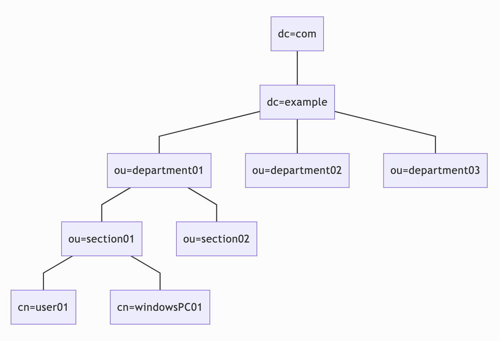

# LDAPとは？
ネットワーク内の「ディレクトリサービス」の維持およびアクセスを行うよう設計された標準プロトコルを指す。ディレクトリサービスとは、ファイル、プリンタ、ユーザ、デバイス、およびサーバなど、さまざまなネットワークリソースを載せた電話帳のようなものである。大きな組織でアカウントを管理するには、部門毎、役割毎に階層構造を作り、社員それぞれのアカウントを分類して運用する必要があり、さらにそのような階層構造は一元管理されている必要がある。LDAPは、このような階層を持つアカウントのグループを、ネットワーク経由で一元管理するための仕組みである。

## 階層構造を管理する仕組み
上記で、階層構造を作りアカウントを管理すると説明したが、LDAPでは階層をドメインで管理する。例えば、Googleを利用するにはURLに「www.google.co.jp」を指定するが、これは右側から「jp」ドメインの中の「co」ドメインに所属する「google」ドメインの「www」というホストという意味である。このように、ドメインは階層を表現するのに適していることから、LDAPではアカウントが所属する階層構造もドメインで管理している。

## RDBとの違い
RDBでは頻繁に更新が行われ、かつ1つのテーブル内の1レコードを更新した際に、別のテーブルが更新されることも多く、それらの一連の処理をトランザクションとして一貫性・整合性を管理している。そのため、複雑なテーブル構造の更新処理に適している反面、負荷が大きい。一方、LDAPは簡単なツリー構造となっており、データベースのような複雑な構造は取れないが、負荷が軽いため、システムアカウントの管理には適しています。
以下、階層構造であるメリットである。
- 階層によるグルーピングにより、管理がしやすい（木構造だから、枝ごとに管理を委任できる）
- 目的のユーザ情報がグルーピングされたディレクトリだけ検索すればよいので、検索のパフォーマンスがよい
- 検索のためのプロトコルとして属性が定義されている。LDAPスキーマとして自分で属性を加えることもできる。

### LDAPの階層構造
LDAPの階層構造について説明する。

| 名称 | 意味 |
| ------ | ------ |
| dc | Domain Component（ドメイン名） |
| ou | Organization Unit（組織単位名） |
| cn | Common Name（一般名） |

　それぞれの要素をエントリといい、エントリには`dc` `ou` `cn`の3つがある。
ouに対して組織を割り当て、cnに対して人やコンピュータやプリンターといったリソースを割り当て、この階層に応じてアクセス権限を付与したりすることができる。例えばsection01に所属する人のみ特定のフォルダにアクセス可能にするといったようなことができる。
　そして、LDAPを触っていると`dn`という用語をよく見かけるが、これはDistinguished Name（識別名）というもので、LDAPサーバ内でリソースを一意に識別するものになる。dnはエントリをリーフからルートまで順番にカンマでつなぐ。例えば図のuser01であればdnは下記のようになる。
`cn=user01,ou=section01,ou=department01,dc=example,dc=com`

ここで記述したエントリやdnの概念は、LDAPに情報を登録する際などに必要である。

## LDAPによって解決できること
つらつらとLDAPについて書いてきたが、結局LDAPで何ができるのかというと、`LDAP認証`や`LDAP連携`といった仕組みにより以下のようなことが実現できる（他にも例はあるが、今回は以下のみの紹介）。
- リソースのアクセス制御
  -  特定のディレクトリに対しては特定の部署に属しているユーザしかアクセスできないというような制御ができる。
- Linuxのシステムアカウント情報の一元化
  - 多数のLinuxクライアントがある場合、1台1台にIDパスワード情報を入れることなく、LDAPサーバ1台だけ登録すれば、どのLinuxクライアントからも同じIDパスワードでログインできるようになる。
- Linuxサーバの各種アプリでのIDパスワード統一化
  - ログインが必要なWebアプリサーバのIDパスワード情報を統一化することができる。

## LDAPサーバとその基本
LDAPサーバとは、LDAPを使ってやりとりできるサーバのことを指す。企業などの組織に1台だけLDAPの規格に従いシングルサインオンのためのリクエストに回答するサーバを設置し、そのサーバでアカウントを管理するのが一般的である。

## LDAPサーバが管理する情報や属性

アカウント名とパスワードのみ管理する訳ではなく、リクエストに応じてアカウントに関する幾つかの属性を受け渡すことが可能である。以下に代表的な項目を示す。

- ユーザーID(例 id00001)
- パスワード
- アカウントの表示名(ゴトウ タカト)
- アカウントの説明(23歳・独身男性)
- ドメイン名(dc=example, dc=build)
- 組織名・部署名(ou=test)
- 氏名(goto takato)
- メールアドレス

## LDAPサーバを導入するには
LDAPサーバを設置する場合、LDAPをサポートしているメーカー製のアカウント管理システムを導入するのが一般的である。
なお、オープンソースのLDAPサーバ（OpenLDAP）も利用でき、今回はOpenLDAPを使用した。

 

## それで、[SpringLDAP](https://spring.pleiades.io/projects/spring-ldap)って？

> Spring LDAP は、NamingExceptions から未チェックの例外階層への例外変換、およびフィルター、LDAP パス、属性を操作するためのいくつかのユーティリティを提供します。（Springの公式ドキュメントより）

公式にもあるように、JavaでのLDAPプログラミングを楽チンにしてくれるライブラリで、Spring Jdbcと同じ原理に基づいて構築された。メモリ上で動作し、アプリケーション起動時にリソースファイルをもとに初期化される、`UnboundID` という簡易サーバーも利用できる。

 

## 今回やったこと

1. Spring InitializrでSpring Bootプロジェクトの生成

    今回、VSCodeで開発を行なった。拡張機能にSpring Initializrがあるため、それを利用してSpring Bootプロジェクトを作成した。
   - 言語
     - Java 11
   - フレームワーク
     - Spring Boot 2.7
   - ビルドツール
     - Maven　3.6.3
   - 依存関係(versionはしょる)
     - Spring Security
     - Spring LDAP
     - Thymeleaf
     - Lombok

 

2. Controllerの作成やWebSecurityConfigの設定etc...

3. docker-compose.ymlを作成してOpenLDAPを利用できるように

4. もろもろ起動して基本動作確認
   
5. 権限制御の確認

6. 

